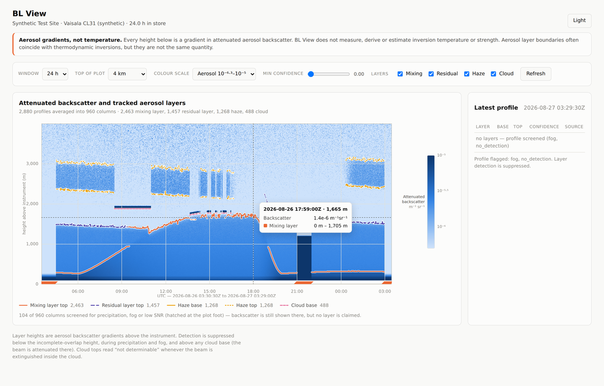

# BL View

A web-based visualisation tool for **atmospheric boundary layer, cloud and
haze-layer detection from raw ceilometer backscatter data**, in the spirit of
Vaisala's BL-View.

> ### Aerosol gradients, not temperature
> Every height BL View reports is a **gradient in attenuated aerosol
> backscatter**. It does not measure, derive or estimate inversion temperature
> or strength, and nothing here is a substitute for a radiosonde, a microwave
> radiometer or an instrumented mast. Aerosol layering is often co-located with
> a thermodynamic inversion — which is what makes it a useful *proxy* — but the
> two can and do decouple. See [Known limitations](#known-limitations).



---

## Run it

One command. It creates a virtualenv, installs dependencies, synthesises 24 h
of realistic raw CL31 data, runs the whole pipeline, asserts the injected
layers were recovered, and serves the quicklook at <http://127.0.0.1:8000>.

```bash
./run.sh
```

```bash
./run.sh --test        # unit tests + validation harness, then stop
./run.sh --no-serve    # build and validate only
./run.sh --hours 48    # longer synthetic series
./run.sh --port 9000
```

No sample file was present in this repository, so the pipeline is built and
validated against generated data. **The synthetic file is not an observation**
and says so in its own header.

---

## What it produces

Three detection products, not one boundary-layer height:

| Product | What it is | Reported |
|---|---|---|
| **Cloud** | Very high, sharp backscatter return | base; top only when the beam survives the cloud |
| **Mixing layer** | Surface-connected aerosol layer | base (surface) and top |
| **Residual layer** | Aged aerosol capping the previous day's mixed layer | base (= mixing top) and top |
| **Haze** | *Decoupled* elevated aerosol layer, typically 1–3 km+ | base and top |

Mixing layer and residual layer are tracked **separately and simultaneously** —
a single-height retrieval reports one of them and silently switches between
them twice a day, which is the failure mode this tool exists to avoid.

Every timestamp yields a list of layers, each
`{type, base_height, top_height (nullable), confidence, track_id, interpolated}`.

---

## Architecture

```
raw files ──► adapter ──► ProfileSet ──► preprocess ──► ProcessedProfiles
                │                                              │
        pluggable per format                                   ▼
        (vaisala_cl, generic_csv, yours)              multi-scale Haar
                                                    covariance transform
                                                              │
                                                              ▼
                                            classify ──► temporal tracking
                                                              │
                        ┌─────────────────────────────────────┘
                        ▼
                 SQLite (layers, quality, grid catalogue)
                 netCDF  (backscatter grids, rolling window)
                        │
                        ▼
                   FastAPI ──► canvas quicklook
```

| Module | Responsibility |
|---|---|
| `blview/adapters/` | Raw-format readers. Registry + sniffing. **The only place a new format touches.** |
| `blview/model.py` | `ProfileSet`, `ProcessedProfiles`, `Layer`, `QualityFlag` — the contract between stages |
| `blview/config.py` | Every threshold in the system, each documented with the reasoning for its default |
| `blview/synth/` | Synthetic raw-file generation with injected ground truth |
| `blview/preprocess.py` | R², background, overlap, noise model, precipitation/fog screening |
| `blview/detect/haar.py` | Haar wavelet covariance transform (Brooks 2003) |
| `blview/detect/layers.py` | Multi-scale edge aggregation, cloud detection, classification |
| `blview/detect/tracking.py` | Hungarian association, flicker removal, gap filling, smoothing |
| `blview/store/` | SQLite index + netCDF grids, rolling-window retention |
| `blview/api.py` | HTTP API |
| `web/` | Single-page canvas quicklook, no build step |
| `blview/validate.py`, `scripts/validate.py` | Validation harness |

### How detection works

1. **Multi-scale edges.** The Haar covariance transform runs at five dilations
   (60–960 m). `W > 0` marks a layer top, `W < 0` a layer base. A 60 m dilation
   localises the sharp cap of a nocturnal stable layer; 960 m is what finds the
   broad, weak entrainment gradient atop a deep afternoon mixed layer. Edges
   seen at several dilations are one physical edge — the finest dilation gives
   the height, the number of dilations gives a persistence score.
2. **Edges are found in log space, localised in linear space.** In linear space
   the near-surface gradient dwarfs every elevated edge; log space makes them
   comparable but biases tops upward, so heights are snapped back onto the
   linear transform's extremum.
3. **Cloud first, at full time resolution.** A cloud return is 100× above noise
   and needs no averaging, whereas averaging would dilute an intermittent
   cumulus below the threshold. Where a cloud is decides what the aerosol
   analysis is allowed to look at.
4. **Classification by structure, not height.** The lowest surface-connected
   top is the mixing layer; an elevated layer with its own detected base and a
   backscatter minimum below it is decoupled → haze; one sitting directly on
   the layer below is contiguous → residual layer.
5. **Tracking.** Optimal (Hungarian) association within a height-jump tolerance
   that grows with the gap; tracks under 5 profiles are discarded as flicker;
   gaps under 15 minutes are filled and **marked as filled**.

Two known *systematic* errors are propagated as **bias, not noise** — summing
per-gate variances would let a correlated error average away and make an
artefact look highly significant. Both reliably produced phantom layers before
this was done: the overlap-model residual (a shallow layer at ~155 m) and the
log-clamp ramp where signal falls below the R²-growing noise floor (a phantom
decoupled layer in clean air).

---

## Validation

`./run.sh --test` runs the unit tests and then the full pipeline against the
synthetic file, asserting the **injected** layers are recovered.

Measured across **seven synthetic days** at different diurnal phases and noise
seeds (2880 profiles each). Ranges, not single-run figures: the dominant
source of variation is how many of the two daily transition windows fall inside
the 24 h window, and a number quoted from one lucky run is not a result.

| feature | detection rate | within tolerance | MAE | max \|bias\| | max false pos. |
|---|---|---|---|---|---|
| cloud base | 98.3 – 100.0 % | 100 % | 24.0 – 24.6 m | 24.6 m | 8.9 % |
| mixing layer top | 92.2 – 98.4 % | 89.9 – 91.5 % | 37.7 – 45.7 m | 33.8 m | 0.0 % |
| residual layer top | 84.4 – 86.1 % | 99.2 – 100 % | 17.0 – 22.7 m | 22.2 m | 0.0 % |
| haze base | 90.2 – 96.0 % | 100 % | 9.0 – 12.2 m | 3.0 m | 5.4 % |
| haze top | 90.2 – 96.0 % | 100 % | 15.5 – 19.9 m | 3.1 m | 5.4 % |

Fog and precipitation screening: **100 % recall** at ~99 % precision.

Tolerances are 50 m for cloud base, 150 m for mixing/residual top and haze
base, 200 m for haze top — roughly one entrainment-zone depth, which is the
physical width of the feature being located.

The mixing-layer top is the weakest feature, and its ~10 % of out-of-tolerance
detections are almost entirely the two transition windows where the mixing and
residual layers merge into one indistinguishable feature (see
[Known limitations](#known-limitations)). Outside those windows the median
error is under 20 m.

**Scoring is restricted to timestamps where the feature was *observable*.** A
ceilometer cannot see through cloud, and fog/precipitation profiles are
screened before detection runs; asserting recovery there would be demanding
that the tool invent data. The truth file records both what was injected and
whether it was observable, and the harness prints both counts.

The pass/fail gates are deliberately set *below* the measured range. They are a
regression guard, not a performance claim — a gate tuned to the best observed
run fails on the next one for reasons that have nothing to do with the code.

---

## Pointing it at real ceilometer data

```bash
# auto-detect the format
.venv/bin/python -m blview.cli ingest /path/to/*.dat

# or name the adapter and override its options
.venv/bin/python -m blview.cli ingest /data/cl51/ \
    --adapter vaisala_cl \
    --adapter-options '{"profile_unit": 1e-9, "strict_crc": true}'

.venv/bin/python -m blview.cli status
.venv/bin/python -m blview.cli serve
```

`ingest` accepts files, directories or globs, and replaces (never duplicates)
any period it re-processes.

### Before trusting the output on real data

The defaults are tuned for a CL31 at 10 m resolution. Four things are worth
checking, in this order:

1. **`profile_unit`** — the physical value of one raw profile count is the
   least well documented part of the CL-series format (ASSUMPTIONS #V4).
   Getting it wrong rescales all backscatter by a constant, which moves the
   *cloud* threshold but leaves every gradient-based layer height unchanged.
   Check that clear-air mixing-layer backscatter lands around
   10⁻⁶–10⁻⁵ m⁻¹ sr⁻¹.
2. **The overlap height** (`preprocess.overlap_full_m`, default 200 m). If you
   have a measured overlap function for your instrument, use it — it is the
   single biggest improvement available, and it is what sets the 90 m floor on
   reportable layer heights.
3. **`noise_ref_bottom_m`** (default 6000 m) assumes nothing above 6 km is
   signal. At a site with routine cirrus or elevated smoke, raise it, or the
   noise scale is overestimated and real layers are suppressed.
4. **The cloud threshold** (`detect.cloud_beta_threshold`, `1e-4`) is the only
   absolute-magnitude threshold in the detection chain and therefore the only
   one sensitive to (1).

Every threshold lives in `blview/config.py` and can be overridden from JSON
without editing code:

```bash
.venv/bin/python -c "from blview.config import Config; Config().save('site.json')"
$EDITOR site.json
.venv/bin/python -m blview.cli ingest /data/*.dat --config site.json
```

### Supporting a different raw format

Write one class. Nothing downstream changes:

```python
from blview.adapters.base import CeilometerAdapter, register_adapter
from blview.model import ProfileSet

@register_adapter
class MyAdapter(CeilometerAdapter):
    name = "my_format"
    description = "..."
    patterns = ("*.myext",)

    @classmethod
    def sniff(cls, path) -> bool:
        ...                      # cheap "is this mine?"; never raise

    def read(self, path) -> ProfileSet:
        return ProfileSet(
            time=...,            # (n_time,)  UTC unix seconds
            range_=...,          # (n_range,) metres above the instrument
            beta=...,            # (n_time, n_range) m-1 sr-1
            range_corrected=False,       # has R^2 already been applied?
            background_subtracted=False,
        )
```

`blview/adapters/generic_csv.py` is a complete worked example — and, because it
reports `range_corrected=False` where the Vaisala adapter reports `True`, it is
what keeps the R² correction path exercised by real data rather than only by
unit tests.

---

## API

| Endpoint | Purpose |
|---|---|
| `GET /api/window?hours=24&max_time=1400&max_range=460&format=json\|binary` | Rolling window of the backscatter grid + layers |
| `GET /api/profile/latest` | The most recent single profile, full vertical resolution, with its layers |
| `GET /api/layers?hours=24&type=haze,cloud&min_confidence=0.5` | Layers only, with full diagnostics |
| `GET /api/status` | What is in the store, and the active thresholds |
| `GET /api/quality-flags?value=3` | Decode a quality bitmask |
| `GET /docs` | Interactive API documentation |

The grid is block-averaged to the requested display size and quantised to one
byte per cell in log10 space — a raw 24 h grid is 2.2 million cells, which as
JSON numbers is tens of megabytes for a picture ~1200 pixels wide. Byte 0 means
*missing*; 1–255 map linearly onto `[vmin, vmax]`. `format=binary` returns the
same payload behind a `BLVW` magic, a version byte, a uint32 header length and
a JSON header, avoiding the base64 overhead.

The API binds to `127.0.0.1` and has **no authentication**. Exposing it on a
network is a deployment decision that needs auth and TLS in front of it.

---

## Known limitations

**It is an aerosol proxy, not a thermometer.** Layer boundaries are aerosol
backscatter gradients. They coincide with thermodynamic inversions often enough
to be useful and not often enough to be trusted blindly. Advection can put an
aerosol edge where there is no inversion; a strong inversion in clean air
produces no aerosol edge at all.

**Residual-layer / decoupling ambiguity is real and not fully solvable.** When
a growing mixing layer erodes the residual layer above it, the aerosol contrast
across the interface falls towards 1 and the two become one indistinguishable
feature. In the synthetic day this happens around 09:00–10:30 and 18:00–19:00,
and it is where essentially all of the remaining mixing-layer error lives (the
93.9 % of hours outside those windows have a median error under 19 m). BL View
reports a single merged layer there rather than inventing a boundary — but it
reports it with a confidence that does not currently reflect the ambiguity.

**Dawn and dusk transitions are the least reliable periods**, for the reason
above and because the layer is changing faster than the 5-minute averaging
window that detection needs.

**Nothing below 90 m.** The instrument-specific overlap function is not
published, so gates where the correction would need to amplify by more than 8×
are masked rather than fabricated. A very shallow nocturnal stable layer
(50–100 m in strong radiative cooling) is missed or pinned at the floor.
Supplying a measured overlap function is the only fix.

**Nothing above a cloud base.** The beam is attenuated; any layer found up
there would be an artefact of the extinction.

**Cloud tops are usually `null`.** A top is claimed only when the signal above
recovers to 2× the noise floor. For a CL31 and liquid cloud it almost never
does.

**Light drizzle and virga may not be screened.** The precipitation screen wants
surface-connected backscatter above `1e-5 m⁻¹ sr⁻¹` filling 800 m or more.
Precipitation too light to reach that, or virga that never reaches the ground,
can be reported as an aerosol layer. This is the most likely source of a wrong
layer in real data.

**Reported heights are 5-minute averages.** A single ceilometer profile is far
too noisy to find a weak elevated gradient; genuinely fast transitions are
smeared over that window.

**Confidence is a relative ranking, not a probability.** It blends edge
significance, scale persistence and contrast, and is penalised inside the
overlap region. It is for sorting and display; 0.7 does not mean "70 % likely
to be correct".

**One ingest is one in-memory block** (~40 MB of RAM per hour of CL31 data at
30 s cadence). Operationally this is not a limit — data arrives incrementally —
but a one-shot ingest of a month of archive would need chunking with overlap,
which is not implemented.

**Tilt is not corrected.** Heights are along-beam range treated as vertical
height. A 4° tilt is a 0.24 % error, far below the detection tolerances.

---

## Assumptions

Every point where the specification was ambiguous or a fact about real hardware
was unavailable is recorded in **[ASSUMPTIONS.md](ASSUMPTIONS.md)**, grouped by
pipeline stage and cross-referenced from the code.

## Reference

Brooks, I. M. (2003), *Finding boundary layer top: application of a wavelet
covariance transform to lidar backscatter profiles*, J. Atmos. Oceanic
Technol., **20**, 1092–1105.
